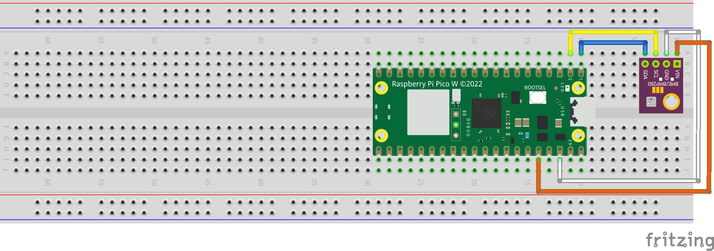

# Bosch BME280 sensor
Temperature, humidity and pressure measurement using a Raspberry Pi Pico W with I2C on the Bosch BME280 and sending its data to an MQTT server.

## Cabling

- I2C0 SDA (pin 1) on `SDA`
- I2C0 SCL (pin 2) on `SCL`
- 3V3(OUT) (pin 36) on `VIN`
- GND (pin 38) on `GND`

## Config
### WiFi
- `SSID` - your WiFi network name
- `PASSWD` - your WiFi network password

### MQTT
- `MQTT_BROKER` - MQTT broker ip-address
- `MQTT_USERNAME` - MQTT username
- `MQTT_PASSWORD` - MQTT password
- `MQTT_CLIENT_ID` - MQTT client ID
- `TOPIC_DIRECTORY` - topic directory to publish to

### update interval
- `time` - time in seconds between updates

## Flashing
- copy both python files on the root folder of the Raspberry Pi Pico W
	- `main.py`
	- `bme280.py`
- copy `config.json` after filling in required information
